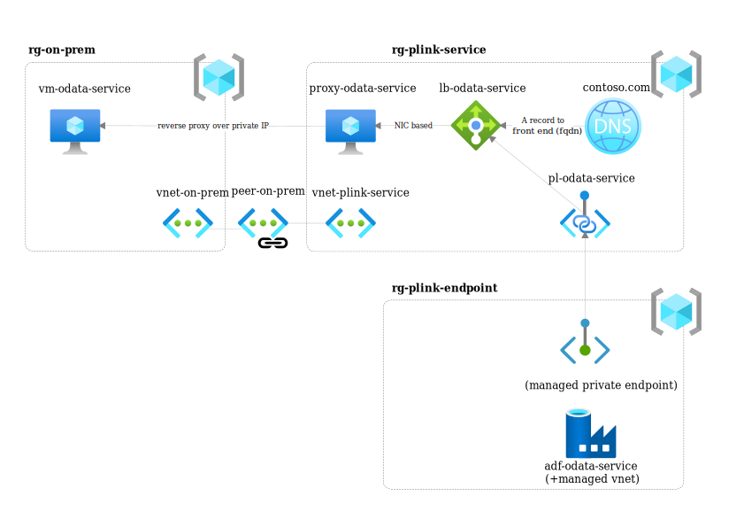
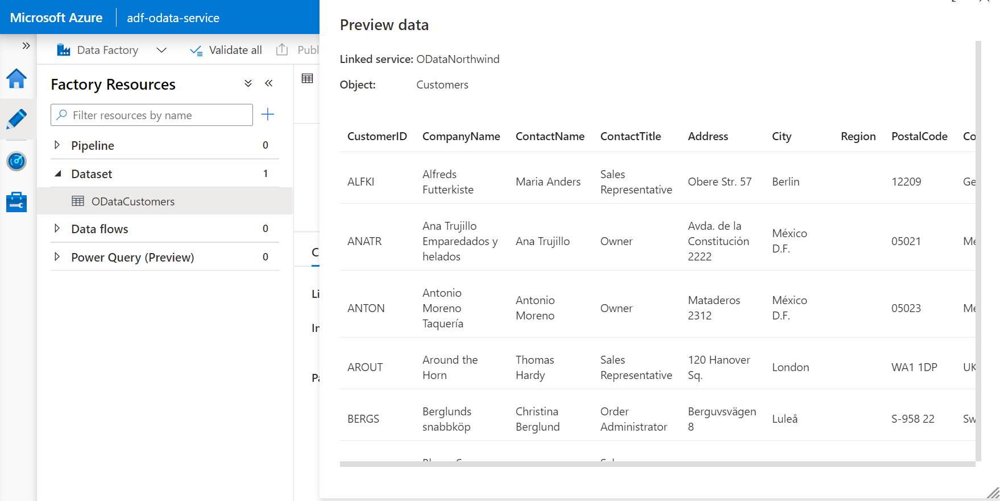

# Using Private Links to access on premises sources

The purpose of this repository is to illustrate how to set up a [Private Link](https://docs.microsoft.com/en-us/azure/private-link/) connection to access resources on private and/or on-premises networks. The end result will look like this:



> The architecture above assumes that the data source is going to be on-premises, which requires an intermediate reverse proxy to enable the Private Link service. This intermediate service is not required if the data source is a VM on Azure. Note that this is a simplified setup, typically the on-premises networks are connected through VPN/Express Route to a hub network on Azure and then peered to other networks (in a [hub-spoke](https://docs.microsoft.com/en-us/azure/architecture/reference-architectures/hybrid-networking/hub-spoke?tabs=cli) topology). Also keep in mind that keeping the data source on-premises might introduce latency issues if the it's accessed frequently.

In this setup the on-premises data source is accessed through a reverse proxy, the proxy is linked to an internal [Load Balancer](https://docs.microsoft.com/en-us/azure/load-balancer/load-balancer-overview) which is then tied to the Private Link Service. The [private DNS zone](https://docs.microsoft.com/en-us/azure/dns/private-dns-overview) includes an A record that points to the front end IP of the load balancer. In order to complete the setup an [Azure Data Factory instance with a managed VNET](https://docs.microsoft.com/en-us/azure/data-factory/managed-virtual-network-private-endpoint) is connected to the data source through a [Private Endpoint](https://docs.microsoft.com/en-us/azure/private-link/private-endpoint-overview). Note that for any other non-managed VNETs the Private Endpoints will need to be created explicitly.

## Mocking the on-premises environment

In order to mimic an on-prem data source, we'll create a new resource group with a new Virtual Network and put the VM that's going to host the OData service on that network. All resources will be created in the same location as the resource group, so pick one that's the closest to you.

```shell
LOCATION=westeurope
RG_ON_PREM=rg-on-prem
az group create -n $RG_ON_PREM -l $LOCATION
```

Once the resource group is ready, we can deploy the sample OData service. The command below will create a a new Virtual Network as well as a new VM (DS2_v3) with an [nginx](https://www.nginx.com/) installation as a reverse proxy to `https://services.odata.org/V3/Northwind/`, which is an online demo OData service. For the purposes of this example, just assume that the VM **is** the data source. And please note it can only be accessed through the private network. It only has port 80 open, so even though there's a (default) username & password for accessing it through SSH, that port won't be open.

```shell
OUTPUTS=`az deployment group create -g $RG_ON_PREM -f on-prem-setup.bicep --query properties.outputs`

VNET_ON_PREM_NAME=`echo "$OUTPUTS" | jq -r .vnetName.value`
VNET_ON_PREM_ID=`echo "$OUTPUTS" | jq -r .vnetId.value`
SRC_VM_IP=`echo "$OUTPUTS" | jq -r .vmIp.value`
```

Since there's no SSH connectivity and the VM resides on a private network, you could use the `az vm run-command` to verify that the installation of the reverse proxy was successful.

```shell
az vm run-command invoke -g $RG_ON_PREM -n vm-odata-service --command-id RunShellScript --scripts "curl -s http://localhost/" --query "value[].message"
```

## Open the private link service

Now we have a data source that can only be accessed through a private ip, we can set up an [Azure Private Link Service](https://docs.microsoft.com/en-us/azure/private-link/private-link-service-overview). Currently Private Link Service requires access to a data source through an (internal) [Azure Load Balancer](https://docs.microsoft.com/en-us/azure/load-balancer/components#frontend-ip-configurations). Before we start creating these resources let's create a separate resource group.

```shell
RG_PL_SVC=rg-plink-service
az group create -n $RG_PL_SVC -l $LOCATION
```

In order to simulate a more realistic situation, we'll set up the Load Balancer in a new Virtual Network that's peered to the on premises network. The following command will set up a new Virtual Network, peer it with the remote network created in the previous step, will deploy various resources, such as the reverse proxy, (internal) Load Balancer, Private Link Service, Private DNS Zones and configure those to work together.

```shell
OUTPUTS=`az deployment group create -g $RG_PL_SVC \
  -f pl-service.bicep \
  --parameters \
    vmOnPremIp=$SRC_VM_IP \
    vnetOnPremId=$VNET_ON_PREM_ID \
    vnetOnPremName=$VNET_ON_PREM_NAME \
    rgOnPremName=$RG_ON_PREM \
  --query properties.outputs`

LB_NAME=`echo "$OUTPUTS" | jq -r .lbName.value`
POOL_NAME=`echo "$OUTPUTS" | jq -r .poolName.value`
PROXY_IP_CONFIG_ID=`echo "$OUTPUTS" | jq -r .ipConfigId.value`
PL_SVC_NAME=`echo "$OUTPUTS" | jq -r .plsName.value`
PL_SVC_ID=`echo "$OUTPUTS" | jq -r .plsId.value`
PL_SVC_FQDNS=`echo "$OUTPUTS" | jq -r .plsFqdns.value`
```

Note that the subnet that's going to be used for the Private Link Service will have to have its `privateLinkServiceNetworkPolicies` attribute set to `false`, which is done automatically by the command above.

An internal Azure Load Balancer can have a backend pool consisting of IP addresses or [Network Interface Configurations (NIC)](https://docs.microsoft.com/en-us/azure/virtual-network/virtual-network-network-interface). However, a load balancer that's used for a Private Link Service **must** have a backend pool of NICs. So, we're going to use the following command to add the NIC of the reverse proxy to the load balancer.

```shell
az network nic ip-config update --ids $PROXY_IP_CONFIG_ID --lb-name $LB_NAME --lb-address-pools $POOL_NAME
```

> It's also possible to configure the backend pool to contain the NIC of the reverse proxy in the bicep file. However, when a VM is added to an (internal) load balancer, it loses outbound Internet connectivity unless it's provided a public IP or a Virtual NAT is configured. Since we need Internet connectivity to set up the nginx installation (the apt packages and the installation script is downloaded from public Internet) we're first setting those up before adding the VM to the load balancer and hence removing outbound Internet connectivity after the setup.

## Connect through the private endpint

The final step is to create an Azure Data Factory with a managed VNET to prove that the connection works.

```shell
RG_PL_EP=rg-plink-endpoint
az group create -n $RG_PL_EP -l $LOCATION
```

Once the resource group is created, we can provision a sample Data Factory with the right parameters and a sample Linked Service pointing to the OData service through Private Links and a sample Dataset to show the results.

```shell
az deployment group create -g $RG_PL_EP -f pl-endpoint.bicep \
  --parameters \
    privateLinkServiceId=$PL_SVC_ID \
    privateLinkServiceFqdns=$PL_SVC_FQDNS \
  --query properties.outputs
```

Once the command above completes, we'd have a Private Endpoint created, but it needs to be approved before the private connection is established.

```shell
PL_EP_NAME=`az network private-link-service show --ids $PL_SVC_ID --query privateEndpointConnections[0].name -o tsv`

az network private-link-service connection update -g $RG_PL_SVC -n $PL_EP_NAME --service-name $PL_SVC_NAME --connection-status Approved 
```

Now if you preview the `ODataCustomers` resource in Azure Data Factory you should see some contents, proving that the private connection is successfully created (need to enable Interactive Authoring for Data Factory to do a preview).


